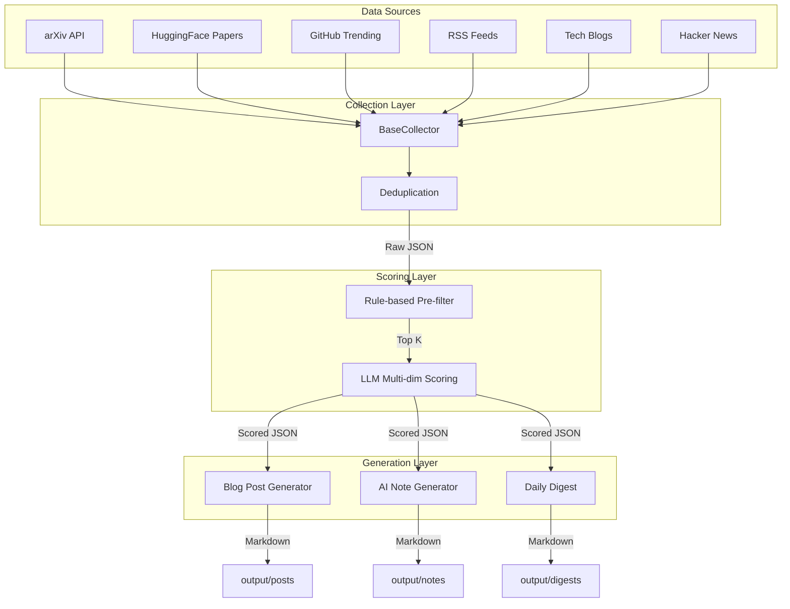

# Auto Post Blog 🤖📝

[](https://www.python.org/downloads/)
[](https://fastapi.tiangolo.com)
[](https://opensource.org/licenses/MIT)

**Auto Post Blog** 是一個自動化的 AI 資訊聚合與摘要生成系統。它能每天自動從多個前沿資料源（arXiv、HuggingFace、GitHub、Tech Blogs、RSS、Hacker News）收集最新的生成式 AI 論文與新聞，透過 Rule-based 與 LLM 雙層價值篩選機制，最終產出高品質的繁體中文「部落格貼文草稿」與「個人 AI 筆記」。它同時配備了一個美觀的 Web Dashboard 供使用者監控、管理與編輯內容。

---

## ✨ 核心特色 (Core Features)

- **🔄 全自動化 Pipeline**：從收集 (Collect) → 評分 (Score) → 生成 (Generate)，支援排程全自動執行與斷點續做。
- **🧠 雙層篩選機制**：
  - _Rule-based 預篩_：自動識別頂流研究機構、熱門話題關鍵字與社群指標（GitHub Stars, HF Upvotes）。
  - _LLM 深度評分_：透過大語言模型就「新穎性、影響力、話題性、實用性、部落格適合度」五大維度進行深度計分。
- **📊 跨來源去重**：內建近期 URL 與 Arxiv ID 的歷史相似度比對機制，避免同一篇論文或新聞被重複產出。
- **🌐 豐富資料源**：
  - arXiv / ChatPaper API 每日最新論文
  - HuggingFace Daily Papers
  - GitHub Trending (AI Repos)
  - 精選 AI Tech Blogs（Karpathy、Simon Willison 等）
  - 主流科技媒體 RSS Feeds
  - Hacker News（透過 Algolia API，依 upvotes 篩選熱門 AI 討論）
- **🖥️ 現代化 Web Dashboard**：
  - 內建精美的 Dark/Light 主題切換。
  - 支援 SSE (Server-Sent Events) 即時日誌串流，隨時掌握 Pipeline 執行進度；支援 Force Stop 中途取消執行。
  - 圖表化呈現來源佔比（Doughnut）、分數分佈（動態區間 Bar Chart）與歷史趨勢。
  - 素材庫（合併 posts + notes，可搜尋、收藏）。
  - 書籤系統與 Kanban 待寫清單（四欄拖曳）。
  - 主題聚合視圖（8 個 topic cluster + 趨勢 sparkline）。
  - 每日摘要（模板式，不需 LLM）。
  - Settings 頁面：可在 UI 直接調整 LLM、評分、Collectors 等所有參數，不需重啟 server。
  - Pipeline Card（GitLab CI/CD 風格）：stage 節點狀態追蹤（running / done / failed / cancelled），支援強制停止、查看各 stage 展開 log。
  - 評分列表來源篩選：Chip 式篩選器，可依資料來源即時過濾評分清單。

## 🏗️ 系統架構 (Architecture)



---

## 🚀 快速開始 (Quick Start)

### 1. 環境安裝

```bash
# 建立並啟動虛擬環境
python3 -m venv .venv
source .venv/bin/activate

# 安裝核心依賴與 Web 介面所需的套件
pip install -e '.[web]'
```

### 2. 環境變數設定

複製範例設定檔並填入您的 API Key（專案預設使用 OpenRouter 取用外部 LLM）：

```bash
cp .env.example .env
# 編輯 .env 填入 OPENROUTER_API_KEY
```

### 3. 微調配置 (Optional)

編輯 `config.yaml` 調整您的偏好設定，或直接在 Web UI 的 `/settings` 頁面進行修改：

- **LLM 模型**（預設為 `arcee-ai/trinity-large-preview:free`，可在 Settings 頁面切換）
- **收集器開關**（視需求開關各資料源）
- **評分權重與閾值**
- **資料保留天數** (`retention_days`)

---

## 💻 終端機指令 (CLI Usage)

Auto Post Blog 提供完整的命令列介面（基於 Typer），所有核心功能皆可拆借使用。

### 完整執行

```bash
# 完整跑一次：收集 → 篩選 → 生成
python -m src.cli run

# 模擬執行（只執行收集與篩選，不呼叫 LLM 產文）
python -m src.cli run --dry-run

# 指定處理歷史日期
python -m src.cli run --date 2026-02-23

# 強制清除所有快取重跑
python -m src.cli run --force
```

### 分段執行與管理

```bash
python -m src.cli collect              # 僅執行資料收集
python -m src.cli score                # 僅執行價值評分
python -m src.cli generate --top-k 3  # 僅將最高分的 3 筆生成文章
python -m src.cli summary              # 檢視當日爬取與評分的分佈摘要
python -m src.cli status               # 檢視最近 7 天執行狀態
python -m src.cli list --days 7        # 列出最近 7 天產出的文章清單
python -m src.cli show output/posts/2026-02-28_slug.md  # 在終端機預覽 Markdown 文章內容
python -m src.cli clean --keep-days 30  # 清理 30 天前的過期資料
python -m src.cli catchup --days 7     # 補跑最近 N 天中遺漏的日期
```

### 每日摘要

```bash
python -m src.cli digest               # 生成今日精選摘要（不需 LLM）
python -m src.cli digest --date 2026-02-28  # 指定日期
```

### 啟動 Web 監控介面

```bash
# 啟動 FastAPI Server（預設 port 8080）
python -m src.cli web
```

瀏覽器開啟 `http://127.0.0.1:8080/dashboard` 即可進入系統戰情室。

---

## ⚙️ 動態設定（Settings UI）

啟動 Web server 後，前往 `http://127.0.0.1:8080/settings` 即可在瀏覽器中即時調整所有參數：

| 區塊 | 可調整項目 |
|------|-----------|
| 🤖 LLM 設定 | API Key、Base URL、主力/備援模型、Max Tokens、Request Delay |
| 📊 評分參數 | Rule 門檻、LLM Top-K、Final Top-K、HF Upvote/GitHub Stars 閾值 |
| 🔧 Pipeline 參數 | 去重回看天數、資料保留天數 |
| 🔌 Collector 設定 | 各資料源開關（arXiv、HF Papers、ChatPaper、RSS、Blogs、GitHub、Hacker News）及各自的收集數量與查詢參數 |

所有設定儲存後**即時生效**，下次執行 pipeline 時自動採用新設定。

---

## ⏱️ 自動化排程 (Cron Setup)

系統內建排程腳本，可輕易整合進 Linux 系統排程，實現「每天起床就有整理好的前沿 AI 資訊」。

```bash
chmod +x setup_cron.sh
./setup_cron.sh
```

_註：預設排程設定為每日早上 10:00 執行（為了配合 HuggingFace Daily Papers 的更新時區）。_

---

## 📂 目錄與輸出結構

Pipeline 產生的所有資料皆會按模組劃分，方便溯源與二次開發：

```text
├── data/
│   ├── raw/             # 每日收集的原始資料快取 (JSON)
│   ├── scored/          # 經由 Rule 與 LLM 評分後的結果清單
│   ├── bookmarks.json   # 書籤/收藏清單（含 writing queue 狀態）
│   ├── feedback/        # Web UI 上使用者給予的品質回饋記錄
│   └── health/          # 各 Collector 的爬取成功率與耗時數據
├── output/
│   ├── posts/           # 寫好的繁體中文部落格草稿 (Markdown + Frontmatter)
│   ├── notes/           # 條列式重點摘錄的個人 AI 筆記
│   ├── digests/         # 每日精選摘要（模板式，不需 LLM）
│   └── prompts/         # 產文時送給 LLM 的完整 Prompt 紀錄（方便 Debug）
└── logs/
    └── {date}.log       # Web UI 觸發的 pipeline 執行日誌
```

---

## 🛠️ 開發與貢獻

本專案使用 `pytest` 確保核心模組的正確性：

```bash
# 執行所有單元與整合測試
pytest tests/ -v
```

歡迎任何 Issue 回報或 Pull Request！如果這個專案對您追蹤 AI 領域的發展有幫助，請不要吝嗇給予一顆 ⭐️。
